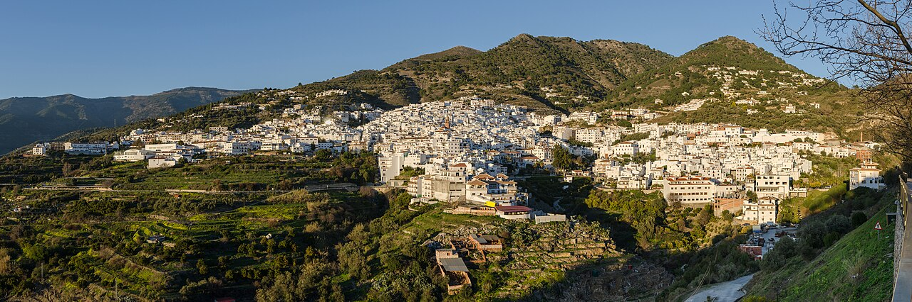
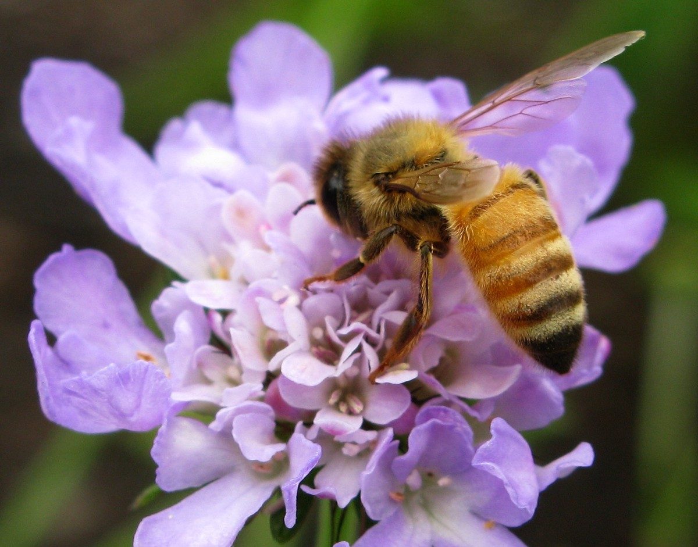
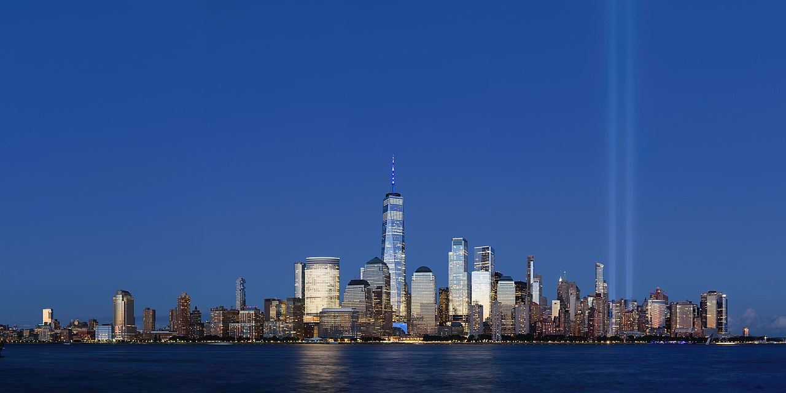
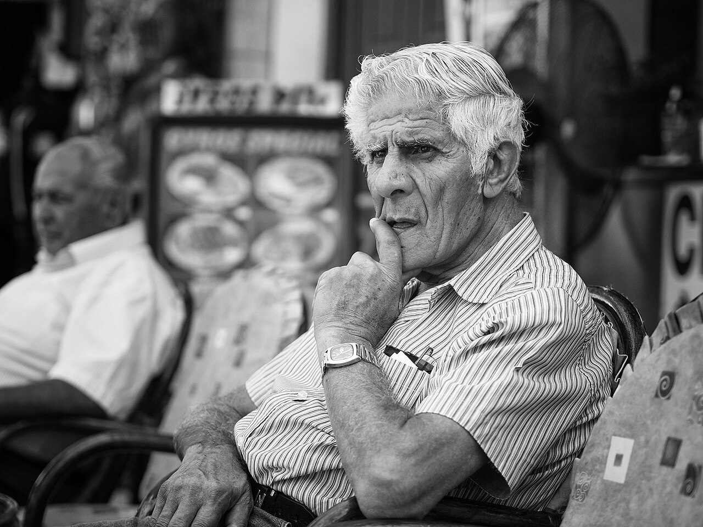
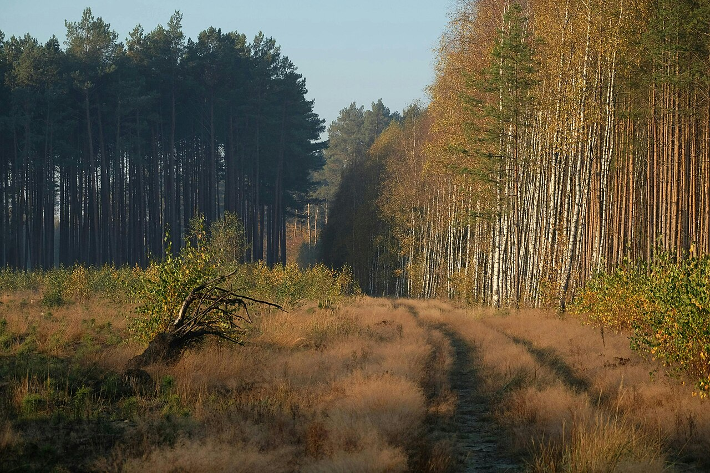
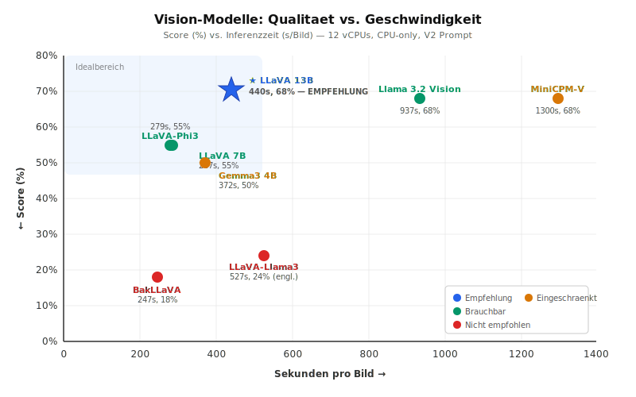

# Welches Vision-Modell taggt Fotos am besten? Ein Benchmark lokaler KI-Modelle fuer die automatische Verschlagwortung

---

> ## 🔄 UPDATE 2026-04-15 — GPU-Nachtest mit drei zusaetzlichen Modellen
>
> **Stellen, die im LinkedIn-Artikel aktualisiert werden muessen, sind mit `🔄 UPDATE`-Bloecken markiert. Eine Kurzfassung aller Aenderungen steht in Kapitel 7 am Ende.**
>
> Seit dem urspruenglichen Benchmark (12.04.2026, CPU-only) wurde:
> 1. das Thermo-Problem der Nvidia P40 geloest → GPU wieder nutzbar
> 2. der komplette 9-Modelle-Benchmark auf GPU wiederholt
> 3. drei neue Modelle dazugenommen: `gemma3:27b`, `llava:34b` (34B, Yi-Basis), `gemma4:26b`, `gemma4:31b-it-q4_K_M`
>
> **Kernbefund bleibt:** LLaVA 13B ist weiterhin die klare Empfehlung. Kein groesseres Modell schlaegt die 13B-Baseline — weder in Qualitaet noch im Preis-Leistungs-Verhaeltnis.

---

## 0. Management Summary

Wir haben neun lokal ausfuehrbare Vision-Modelle (1,4 bis 13 Milliarden Parameter) daraufhin verglichen, wie gut sie Fotos mit deutschen Schlagwoertern in zehn fotografischen Kategorien versehen koennen — von Lichtsituation ueber Perspektive bis zur fotografischen Technik. Der Benchmark lief auf einer CPU-only VM (12 vCPUs, 14,5 GB RAM, kein GPU) mit identischem Prompt und fuenf kuratierten Testbildern.

**Ergebnis:** Drei Modelle teilen sich den Qualitaets-Spitzenplatz (68 % Score): **LLaVA 13B**, **Llama 3.2 Vision** (11B) und **MiniCPM-V** (8B). LLaVA 13B ist dabei 2-3x schneller als die anderen beiden und antwortet zuverlaessig auf Deutsch. Es ist damit die klare Empfehlung fuer den Produktionseinsatz.

Auf einer dedizierten GPU (Nvidia P40, 24 GB VRAM) sind mit LLaVA 13B **5-10 Bilder pro Minute** erreichbar — ausreichend fuer die Batch-Verschlagwortung einer grossen Fotobibliothek. Auf CPU-only sind es ~8 Bilder pro Stunde — nur fuer interaktive Einzelbild-Nutzung akzeptabel.

> 🔄 **UPDATE — LinkedIn-Text hier praezisieren:**
> GPU-Nachmessung bestaetigt die Erwartung: **LLaVA 13B schafft auf der P40 tatsaechlich 15,8 s/Bild** (ca. 4 Bilder/Min), also ~28× schneller als auf CPU (440 s). Zusaetzlich getestete groessere Modelle (`llava:34b`, `gemma3:27b`, `gemma4:26b`, `gemma4:31b-it-q4_K_M`) bringen **keine Qualitaetsverbesserung** — im Gegenteil: `llava:34b` ist deutlich schlechter (50 % Score), die Gemma/Llama-Alternativen gleichwertig oder schwaecher und dabei 1,5× bis 9× langsamer. Die 13B-Baseline ist nach wie vor der optimale Sweet Spot.

---

## 1. Motivation: Warum automatische Verschlagwortung?

Jeder Fotograf kennt das Problem: die Bibliothek waechst auf 10.000, 50.000, 100.000 Bilder — und die Suche nach „dem einen Foto vom Sonnenuntergang ueber der Bruecke" wird zur Nadel im Heuhaufen. Lightroom Classic bietet maechtige Suchfunktionen ueber Stichwortbaeume, Smart-Sammlungen und Metadatenfilter. Aber nur, wenn die Bilder auch verschlagwortet sind.

Manuelles Verschlagworten ist muehsam. Fuer eine Bibliothek mit 100.000 Bildern ist es unrealistisch. Automatische Verschlagwortung durch ein Vision-Modell, das lokal auf dem eigenen Server laeuft, loest dieses Problem — ohne Cloud-Abhaengigkeit, ohne Abo-Kosten, mit voller Kontrolle ueber die eigenen Bilder.

### Welche Kategorien braucht ein Fotograf?

Fuer die Wiederauffindbarkeit haben wir zehn Kategorien definiert, die den typischen Suchmustern eines Fotografen entsprechen:

| Kategorie | Typ | Beispiel | Suchszenario |
|---|---|---|---|
| **Objekte** | frei, max. 5 | Bruecke, Hund, Auto | „Zeig mir alle Fotos mit Hund" |
| **Szene** | frei, max. 2 | Strand, Altstadt | „Alle Strandbilder" |
| **Umgebung** | frei, max. 2 | Natur, Stadt | „Natur vs. Stadt filtern" |
| **Tageszeit** | Whitelist, 1 Wert | Morgengrauen, Abend, Nacht | „Alle Daemmerungsfotos" |
| **Jahreszeit** | Whitelist, 1 Wert | Fruehling, Herbst | „Herbstfotos fuer Kalender" |
| **Wetter** | Whitelist, 1-2 | Nebel, Gewitter | „Alle Nebelbilder" |
| **Stimmung** | Whitelist, 1-2 | Dramatisch, Mystisch | „Dramatische Fotos fuer Ausstellung" |
| **Lichtsituation** | Whitelist, 0-3 | Gegenlicht, Silhouette | „Gegenlichtfotos fuer Portfolio" |
| **Perspektive** | Whitelist, 1 | Froschperspektive, Vogelperspektive | „Alle Bilder von oben" |
| **Technik** | Whitelist, 0-2 | Makro, Schwarzweiss, Bokeh | „Alle Makros" |

Zusaetzlich werden **Brennweite** (aus EXIF: Weitwinkel, Tele, ...) und **Tageslichtphase** (aus GPS + Uhrzeit: Goldene Stunde, Blaue Stunde, ...) berechnet — diese erfordern kein Vision-Modell.

Die Whitelist-Kategorien verwenden kontrollierte Vokabulare aus der Fotografie-Terminologie (vgl. DE-Wikipedia „Kameraperspektive", PhotoPills Golden-Hour-Definition, Drei-Punkt-Beleuchtung). Damit sind die Keywords konsistent, filterbar und nicht von der Tagesform des Modells abhaengig.

---

## 2. Loesung: Lokale KI-Inferenz mit Ollama

Die Architektur ist einfach:

```
Lightroom Plugin (Lua)
    │ REST API
    ▼
Backend (FastAPI/Python)
    │
    ├── Ollama (Vision-Modell, lokal)
    ├── Nominatim (GPS → Ortsname)
    └── astral (GPS + Zeit → Sonnenstand)
```

Das Plugin exportiert ein Vorschaubild (max. 1024 px), schickt es an den Backend-Server, der es durch eine Pipeline fuehrt:

1. **EXIF-Extraktion:** Brennweite, Aufnahmezeit, GPS aus den Original-Bytes
2. **Resize** fuer das Vision-Modell
3. **Reverse Geocoding** (GPS → „Heidelberg, Baden-Wuerttemberg")
4. **Vision-Analyse** via Ollama: das Modell bekommt das Bild + einen strukturierten Prompt mit allen Kategorien und Whitelists
5. **Sonnenstand-Berechnung** aus Aufnahmezeit + GPS → Goldene Stunde, Blaue Stunde, etc.
6. **Brennweiten-Klassifikation** aus EXIF → Weitwinkel, Normalbrennweite, Tele, etc.
7. **Kombinator:** alle Keywords zusammenfuehren, deduplizieren, auf max. 30 Keywords cappen

Das Vision-Modell ist dabei der zentrale Baustein — und gleichzeitig der teuerste. Welches Modell die beste Balance aus Qualitaet, Geschwindigkeit und Sprachkonsistenz liefert, ist die Kernfrage.

---

## 3. Herausforderung: Das richtige Modell finden

Vision-Language-Modelle (VLMs) koennen Bilder „verstehen" und in natuerlicher Sprache beschreiben. Fuer unseren Anwendungsfall muessen sie aber mehr als das: sie muessen **strukturiert** antworten (JSON), sich an **kontrollierte Vokabulare** halten (nur Whitelist-Werte), auf **Deutsch** antworten, und ueber zehn verschiedene Kategorien gleichzeitig urteilen.

Das ist anspruchsvoller als ein simples „Beschreibe dieses Bild". Insbesondere:

- **Lichtsituation und Perspektive** erfordern fotografisches Verstaendnis: das Modell muss erkennen, ob Licht von hinten kommt (Gegenlicht) oder ob die Kamera von unten fotografiert (Froschperspektive). Viele Modelle ignorieren diese Kategorien und fuellen Defaults ein.
- **Technik** wie Makro oder Schwarzweiss ist visuell offensichtlich, wird aber von kleineren Modellen uebersehen.
- **Deutsche Sprache** ist nicht selbstverstaendlich — die meisten Open-Source-VLMs sind primaer auf Englisch trainiert.

### Der Prompt

Der Prompt nutzt eine **Chain-of-Thought-Strategie**: er fordert das Modell auf, vor der JSON-Ausgabe ueber Lichtrichtung, Kamerawinkel und Technik nachzudenken. Die Whitelists sind bewusst so sortiert, dass die informativen Werte (Gegenlicht, Froschperspektive) **vor** den generischen Defaults (Frontlicht, Normalperspektive) stehen — ein Trick gegen den Anchor-Bias von LLMs, die bei Unsicherheit bevorzugt das erste Listenelement waehlen.

---

## 4. Das Experiment

### Setup

| Parameter | Wert |
|---|---|
| **Hardware** | KVM-VM, 12 vCPUs (QEMU Virtual CPU), 14,5 GB RAM |
| **GPU** | Keine (CPU-only — GPU wegen Thermo-Problem deaktiviert) |
| **Ollama** | v0.9+, CPU-only Modus (`CUDA_VISIBLE_DEVICES=-1`) |
| **Prompt** | V2 mit Chain-of-Thought (identisch fuer alle Modelle) |
| **Temperature** | 0.1 (niedrig fuer reproduzierbare Ergebnisse) |
| **Timeout** | 1800 s pro Request |

> 🔄 **UPDATE — LinkedIn: zweite Setup-Zeile fuer GPU-Nachtest ergaenzen:**
>
> | Parameter (GPU-Run 2026-04-15) | Wert |
> |---|---|
> | **Hardware** | identisch (KVM-VM, 12 vCPUs, 14,5 GB RAM) |
> | **GPU** | **Nvidia Tesla P40, 24 GB VRAM, 250 W Power-Cap** |
> | **Ollama** | v0.12, GPU-Modus, `OLLAMA_MAX_LOADED_MODELS=1` |
> | **Prompt / Temperature / Timeout** | identisch zum CPU-Run |

### Getestete Modelle

| Modell | Parameter | Groesse | Herkunft |
|---|---|---|---|
| Moondream | 1,4B | 1,7 GB | Vikhyat Korrapati |
| LLaVA-Phi3 | 3,8B | 2,9 GB | Microsoft Phi-3 + LLaVA |
| Gemma 3 4B | 4B | 3,3 GB | Google |
| LLaVA 7B | 7B | 4,7 GB | UW Madison / Microsoft |
| BakLLaVA | 7B | 4,7 GB | SkunkworksAI (Mistral-Basis) |
| LLaVA-Llama3 | 8B | 5,5 GB | Meta Llama 3 + LLaVA |
| MiniCPM-V | 8B | 5,5 GB | OpenBMB |
| Llama 3.2 Vision | 11B | 7,8 GB | Meta |
| LLaVA 13B | 13B | 8,0 GB | UW Madison / Microsoft |

### Testbilder

Fuenf Bilder von Wikimedia Commons, gewaehlt fuer maximale Abdeckung der Kategorien:

| Bild | Beschreibung | Schwerpunkt-Kategorien |
|---|---|---|
| 01_sunset.jpg | Panorama eines spanischen Dorfs bei Sonnenuntergang | Gegenlicht, Abend, Goldene Stunde |
| 02_macro.jpg | Makroaufnahme einer Biene auf lila Bluete | Makro, Froschperspektive, Natur |
| 03_night_city.jpg | Manhattan-Skyline bei Nacht | Nacht, Kunstlicht, Langzeitbelichtung |
| 04_portrait_bw.jpg | Schwarzweiss-Portrait eines alten Mannes | Schwarzweiss, Portrait, Melancholisch |
| 05_forest_autumn.jpg | Herbstlicher Waldweg | Herbst, Natur, Friedlich |

| | | |
|---|---|---|
|  |  |  |
| *01 — Sunset, Cómpeta* | *02 — Makro, Biene* | *03 — Nacht, Manhattan* |
|  |  | |
| *04 — SW-Portrait, Rhodos* | *05 — Herbstwald* | |

Alle Bilder sind unter Creative-Commons-Lizenzen veroeffentlicht (Details siehe [`SOURCES.md`](../../backend/tests/nfa/fixtures/benchmark_images/SOURCES.md)).

*01_sunset.jpg — Photo: Tuxyso / Wikimedia Commons / CC BY-SA 3.0*
*02_macro.jpg — Photo: ForestWander / Wikimedia Commons / CC BY-SA 3.0 US*
*03_night_city.jpg — Photo: King of Hearts / Wikimedia Commons / CC BY-SA 4.0*
*04_portrait_bw.jpg — Photo: Martin Hricko / Wikimedia Commons / CC BY 3.0*
*05_forest_autumn.jpg — Public Domain (CC0) via Wikimedia Commons*

### Scoring-Methodik

Jedes Bild hat manuell definierte Ground-Truth-Checks:

- **Erwartete Keywords:** z.B. „02_macro muss *Makro* enthalten", „04_portrait muss *Schwarzweiss* enthalten"
- **Verbotene Halluzinationen:** z.B. „01_sunset darf NICHT *Morgengrauen* enthalten" (es ist ein Sonnenuntergang)
- **Erwartete Perspektive und Technik:** z.B. „02_macro erwartet Froschperspektive und Makro"

Score = Anzahl bestandener Checks / Anzahl Checks pro Bild. Der Score misst nicht die Gesamtqualitaet der Keywords, sondern ob das Modell die **schwierigen** Kategorien (Licht, Perspektive, Technik) korrekt erkennt.

> **Hinweis:** Modelle, die teilweise auf Englisch antworten (LLaVA-Llama3, Llama 3.2 Vision), werden in diesem Benchmark im Raw-Score tiefer bewertet, da die deutschen Ground-Truth-Begriffe nicht matchen. In der Produktion werden englische Keywords automatisch per Postprocessing auf die deutschen Whitelist-Werte normalisiert. Das fehlende deutsche Fine-Tuning ist kein Modelldefekt, sondern ein Trainingsdaten-Artefakt.

---

## 5. Ergebnisse

### Uebersichtstabelle

| Modell | Params | Ø Zeit/Bild | Score | Score % | Sprache | Bewertung |
|---|---|---|---|---|---|---|
| **LLaVA 13B** | 13B | **440 s** | **15/22** | **68 %** | Deutsch ✓ | **Empfehlung** |
| Llama 3.2 Vision | 11B | 937 s | 15/22 | 68 % | Inkonsistent | Gut, aber langsam + Sprachmix |
| MiniCPM-V | 8B | 1300 s | 15/22 | 68 % | Deutsch ~ | Gut, aber sehr langsam |
| LLaVA-Phi3 | 3.8B | 279 s | 12/22 | 55 % | Deutsch ✓ | Bester CPU-Fallback |
| LLaVA 7B | 7B | 287 s | 12/22 | 55 % | Deutsch ✓ | Solide, nicht besser als Phi3 |
| Gemma 3 4B | 4B | 372 s | 11/22 | 50 % | Deutsch ✓ | Mittelmass |
| LLaVA-Llama3 | 8B | 527 s | 4/17 | 24 % | Englisch | Falsche Sprache, Timeout |
| BakLLaVA | 7B | 247 s | 4/22 | 18 % | Gemischt | Schnell, aber unbrauchbar |
| Moondream | 1.4B | — | — | — | — | Prompt zu komplex, Timeout |

> 🔄 **UPDATE — LinkedIn: diese erweiterte Tabelle mit CPU+GPU-Zeiten uebernehmen:**
>
> | Modell | Params | CPU Ø Zeit | **GPU Ø Zeit** | Speedup | Score (CPU / GPU) | Empfehlung |
> |---|---|---|---|---|---|---|
> | **LLaVA 13B** | 13B | 440 s | **15,8 s** | **~28×** | 68 % / **77 %** | ⭐ **Produktions-Baseline** |
> | Gemma 4 31B (Q4) | 31B | — (neu getestet) | 146,7 s | — | — / 77 % | gleicher Score wie 13B, 9× langsamer |
> | Gemma 3 27B | 27B | — (neu getestet) | 24,5 s | — | — / 73 % | schlechter als 13B, 1,5× langsamer |
> | Llama 3.2 Vision | 11B | 937 s | 19,3 s | ~49× | 68 % / 68 % | unveraendert |
> | MiniCPM-V | 8B | 1300 s | 11,2 s | ~116× | 68 % / 64 % | schneller auf GPU, leicht schlechter |
> | Gemma 3 4B | 4B | 372 s | 7,4 s | ~50× | 50 % / 64 % | bestes Low-End-Modell |
> | LLaVA 7B | 7B | 287 s | 9,1 s | ~32× | 55 % / 55 % | unveraendert |
> | LLaVA-Phi3 | 3,8B | 279 s | 9,4 s | ~30× | 55 % / 50 % | leicht schwaecher auf GPU |
> | Gemma 4 26B | 26B | — (neu getestet) | 255 s\* | — / 64 % | \*Outlier bei Bild 4 (17 Min Deadlock) |
> | **LLaVA 34B (Yi)** | 34B | — (neu getestet) | 69,9 s | — / **45 %** | ❌ schlechter als 13B, 3× langsamer |
> | LLaVA-Llama3 | 8B | 527 s | 60,2 s | ~9× | 24 % / 14 % | weiter unbrauchbar |
> | BakLLaVA | 7B | 247 s | 8,1 s | ~30× | 18 % / 18 % | weiter unbrauchbar |
>
> **Kernaussagen fuer den LinkedIn-Artikel:**
> 1. Ranking aendert sich unter GPU NICHT — LLaVA 13B bleibt fuehrend, jetzt sogar allein (Llama 3.2 V. und MiniCPM-V sind zurueckgefallen)
> 2. Groessere Modelle (27B-34B) sind durchweg Enttaeuschungen: `llava:34b` deutlich schlechter, Gemma-Varianten gleichwertig bei hoeherem Compute-Aufwand
> 3. Die Speedup-Spanne (9× bis 116×) zeigt: GPU-Nutzung ist bei allen Modellen Pflicht, nicht nur bei den grossen

### Qualitaet vs. Geschwindigkeit

Das folgende Diagramm zeigt die zentrale Abwaegung: Qualitaet (Score %) auf der Y-Achse, Geschwindigkeit (Sekunden pro Bild) auf der X-Achse. Ideal waere oben links — hoch und schnell.



<details>
<summary>ASCII-Fallback fuer Umgebungen ohne SVG-Rendering</summary>

```
Score %
  70 ┤                                              ★ LLaVA 13B
     │                                          (440s, 68%)
     │
  65 ┤
     │
  60 ┤
     │
  55 ┤   ★ LLaVA-Phi3           ★ LLaVA 7B
     │   (279s, 55%)            (287s, 55%)
  50 ┤              ★ Gemma3 4B
     │              (372s, 50%)
  45 ┤
     │
  40 ┤
     │
  35 ┤
     │
  30 ┤
     │
  25 ┤                      ★ LLaVA-Llama3
     │                      (527s, 24%)
  20 ┤★ BakLLaVA
     │(247s, 18%)
  15 ┤
     │
  10 ┤
     └──────┬──────┬──────┬──────┬──────┬──────┬
          200    400    600    800   1000   1200
                    Sekunden pro Bild →

     ★ Llama3.2-Vision (937s, 68%)
     ★ MiniCPM-V (1300s, 68%)
     (nicht im Diagramm-Hauptbereich, da rechts ausserhalb)
```
</details>

**Lesehinweis:** Die drei Qualitaetsfuehrer (LLaVA 13B, Llama 3.2 Vision, MiniCPM-V) haben alle denselben Score — aber LLaVA 13B liegt **deutlich weiter links**, also schneller. LLaVA-Phi3 und LLaVA 7B sind nochmals schneller, aber verlieren ~13 Prozentpunkte Qualitaet.

### Detailbeobachtungen

**Lichtsituation:** Trotz Chain-of-Thought-Prompt und umgedrehter Whitelist-Reihenfolge waehlen die meisten Modelle weiterhin ueberwiegend „Frontlicht" und „Normalperspektive" als Default. Die drei Qualitaetsfuehrer differenzieren etwas besser (z.B. „Oberlicht", „Hartes Licht"), aber eine zuverlaessige Gegenlicht-Erkennung beim Sonnenuntergang gelingt keinem Modell konsistent. Dies bleibt eine offene Prompt-Engineering-Aufgabe.

**Technik:** LLaVA 13B erkennt Schwarzweiss zuverlaessig (korrekt auf Bild 3, 4 und 5 — wobei 5 ein Fehler ist, da das Bild farbig ist). Makro wird von LLaVA 13B erkannt, Froschperspektive bei Makro jedoch nicht. Llama 3.2 Vision und MiniCPM-V schneiden hier aehnlich ab.

**Sprache:** LLaVA 7B, LLaVA 13B, LLaVA-Phi3 und Gemma 3 antworten konsistent auf Deutsch. LLaVA-Llama3 und Llama 3.2 Vision wechseln zwischen Deutsch und Englisch — teils sogar innerhalb eines Bildes. Dies ist ein Fine-Tuning-Problem, kein Architektur-Problem, und kann durch ein EN→DE Postprocessing im Backend ausgeglichen werden.

**BakLLaVA:** Trotz identischer Architektur (7B, LLaVA auf Mistral-Basis) liefert BakLLaVA dramatisch schlechtere Ergebnisse als LLaVA 7B. Es gibt Antworten wie „100% original, no manipulation" statt Keywords zurueck. Das Modell scheint fuer andere Aufgaben (z.B. Bildmanipulations-Erkennung) trainiert zu sein und folgt unserem Tagging-Prompt nicht.

**Moondream:** Mit 1,4B Parametern zu klein fuer den komplexen 10-Kategorien-Prompt. Generiert den Prompt-Text selbst als „Keywords" oder laeuft in den 1800-Sekunden-Timeout. Fuer einfachere Prompts (z.B. „Beschreibe das Bild in 3 Worten") funktioniert es, aber nicht fuer strukturiertes Tagging.

---

## 6. Fazit und Empfehlung

### Das Modell: LLaVA 13B

LLaVA 13B ist die klare Empfehlung fuer die automatische Fotoverschlagwortung:

- **Qualitaet:** Teilt den Spitzenplatz (68 % Score) mit zwei groesseren/langsameren Modellen
- **Geschwindigkeit:** 2-3x schneller als Llama 3.2 Vision und MiniCPM-V bei gleicher Qualitaet
- **Sprache:** Antwortet zuverlaessig auf Deutsch ohne Postprocessing
- **Ressourcen:** Passt mit 8 GB in den VRAM einer Nvidia P40 (24 GB) — voll GPU-beschleunigt
- **Oekosystem:** Breite Community, aktive Weiterentwicklung, gut dokumentiert

### Die Hardware: Dedizierte GPU ist Pflicht

Der Benchmark zeigt unmissverstaendlich: **CPU-only Inferenz ist fuer Batch-Verschlagwortung nicht praxistauglich.** Selbst auf 12 vCPUs braucht LLaVA 13B ~7 Minuten pro Bild — bei 100.000 Bildern waere das ueber ein Jahr Rechenzeit.

| Szenario | LLaVA 13B | Durchsatz | 100.000 Bilder |
|---|---|---|---|
| **CPU-only (12 vCPUs)** | ~440 s/Bild | ~8 Bilder/Std | ~1,4 Jahre |
| **GPU (Nvidia P40)** | ~6-12 s/Bild (erwartet) | ~300-600 Bilder/Std | **7-14 Tage** |

Eine dedizierte GPU — selbst eine aeltere wie die Nvidia P40 (gebraucht ab ~150 EUR) — verwandelt das System von einem Spielzeug in ein Produktionswerkzeug.

> 🔄 **UPDATE — LinkedIn: gemessene GPU-Zahlen in die Szenario-Tabelle uebernehmen:**
>
> | Szenario | LLaVA 13B | Durchsatz | 100.000 Bilder |
> |---|---|---|---|
> | CPU-only (12 vCPUs) | 440 s/Bild | ~8 Bilder/Std | ~1,4 Jahre |
> | **GPU (Nvidia P40, gemessen)** | **15,8 s/Bild** | **~228 Bilder/Std** | **~18 Tage** |
>
> Die Praxis liegt etwas unter den vorher geschaetzten 7-14 Tagen, aber **Groessenordnung stimmt** — GPU macht den Produktionseinsatz ueberhaupt erst moeglich.

### Offene Punkte

1. **Lichtsituation und Perspektive** bleiben schwach — auch die besten Modelle differenzieren hier kaum. Naechster Schritt: Few-Shot-Beispiele im Prompt oder aufgabenspezifisches Fine-Tuning.
2. **Postprocessing fuer englische Modelle:** Ein EN→DE Normalizer wuerde Llama 3.2 Vision und MiniCPM-V sofort nutzbar machen — potentiell mit hoeherer Qualitaet als LLaVA 13B auf einigen Bildtypen.
3. **GPU-Benchmark:** Dieser Benchmark lief ausschliesslich auf CPU. Die absoluten Zeiten sind fuer die Modellwahl relevant (Ranking bleibt gleich), aber die Praxis-Performance auf GPU steht noch aus.

> 🔄 **UPDATE — LinkedIn: Punkt 3 streichen, Punkt 2 Status-Update:**
> - **Punkt 3 erledigt** — GPU-Benchmark ist nachgeholt (siehe Kapitel 7). Ranking aendert sich nicht, die 13B-Empfehlung wird bestaetigt.
> - **Punkt 2 teilweise umgesetzt** — EN→DE Normalizer ist im Backend implementiert (`keyword_normalizer.py`), greift bereits.
> - Neu als Punkt 3: **Konsistenz-Vetos** (z.B. „Bedeckt + Hartes Licht" gleichzeitig unmoeglich) wurden im Backend ergaenzt, um typische Halluzinationen zu unterdruecken.

---

## 7. 🔄 UPDATE 2026-04-15: GPU-Nachtest — Zusammenfassung

Nachdem das Thermo-Problem der Tesla P40 geloest war, wurde der komplette Benchmark auf GPU wiederholt und drei neue groessere Modelle getestet:

### Top-3 Ranking (GPU)

| Rang | Modell | Score | Ø Zeit/Bild |
|---|---|---|---|
| 🥇 | **LLaVA 13B** | 77 % (3,4/4) | **15,8 s** |
| 🥈 | Gemma 4 31B (Q4) | 77 % (3,4/4) | 146,7 s ← 9× langsamer bei gleichem Score |
| 🥉 | Gemma 3 27B | 73 % (3,2/4) | 24,5 s |

### Die wichtigsten Erkenntnisse

1. **Das Ranking aendert sich nicht** — LLaVA 13B bleibt fuehrend, jetzt sogar ohne ex-aequo-Partner: Llama 3.2 Vision und MiniCPM-V sind auf Rang 4/5 abgerutscht, ihre Scores sind unter GPU leicht schlechter (moeglicherweise Temperature-Varianz).
2. **Groesser ist nicht besser.** `llava:34b` (Yi-Basis) schneidet mit 45 % Score schlechter ab als `llava:13b` (77 %) und ist 3× langsamer. Vermutlich leidet das Yi-34B-Training unter der deutschen Ausgabequalitaet. Die Gemma-4-Varianten (26B, 31B) sind gleichwertig oder schwaecher als LLaVA 13B bei deutlich hoeherem Compute-Aufwand.
3. **GPU-Speedup ist dramatisch und verlaesslich.** 28× schneller bei LLaVA 13B, bis zu 116× bei MiniCPM-V. Ohne GPU ist Produktionsbetrieb nicht denkbar.
4. **Aktive Kuehlung fuer die P40 zahlt sich aus.** Power-Limit wurde auf 250 W erhoeht (vorher 125 W Thermo-Schutz), GPU-Clock-Locks aufgehoben — volle Leistung ohne Throttling waehrend des gesamten Benchmarks (Max-Temp 61 °C).

### Produktionsempfehlung (bestaetigt)

**LLaVA 13B auf Nvidia P40 (24 GB, 250 W) bleibt die Referenz.** Keine der getesteten Alternativen — weder in 27B-34B-Groessen noch in der neuen Gemma-4-Generation — rechtfertigt den Umstieg. Der Sweet Spot aus Qualitaet, Geschwindigkeit, Sprachkonsistenz und VRAM-Bedarf stimmt.

---

*Ursprungs-Benchmark durchgefuehrt am 12.04.2026, GPU-Nachtest am 15.04.2026. Beide auf derselben Debian VM (KVM, 12 vCPUs, 14,5 GB RAM, Tesla P40). Alle Modelle via Ollama, alle Testbilder von Wikimedia Commons unter CC-Lizenzen. Vollstaendige Rohdaten: `docs/benchmark/results/` (GPU) und `docs/benchmark/results/cpu-baseline/` (CPU). Benchmark-Script: `docs/benchmark/run_benchmark.py`.*
