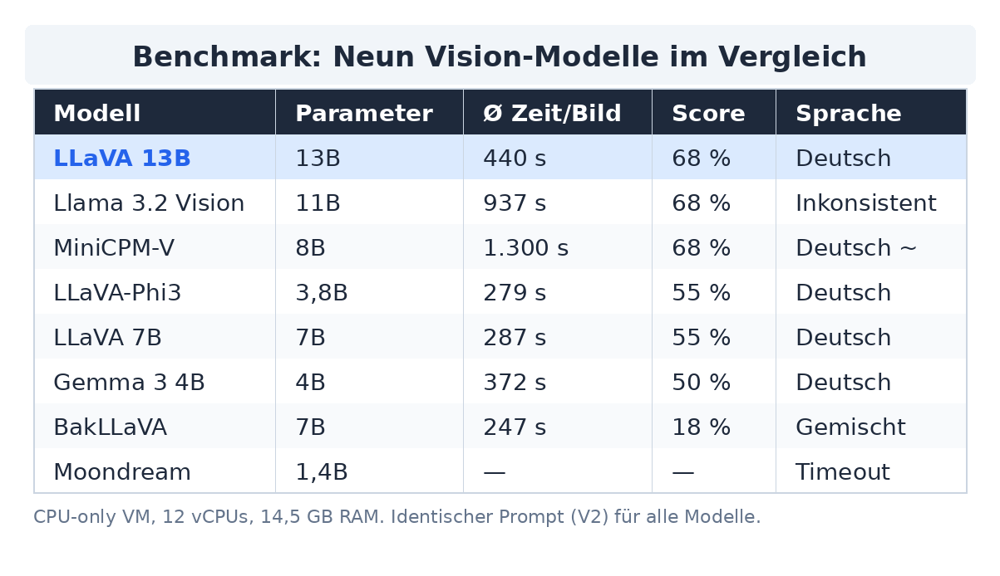
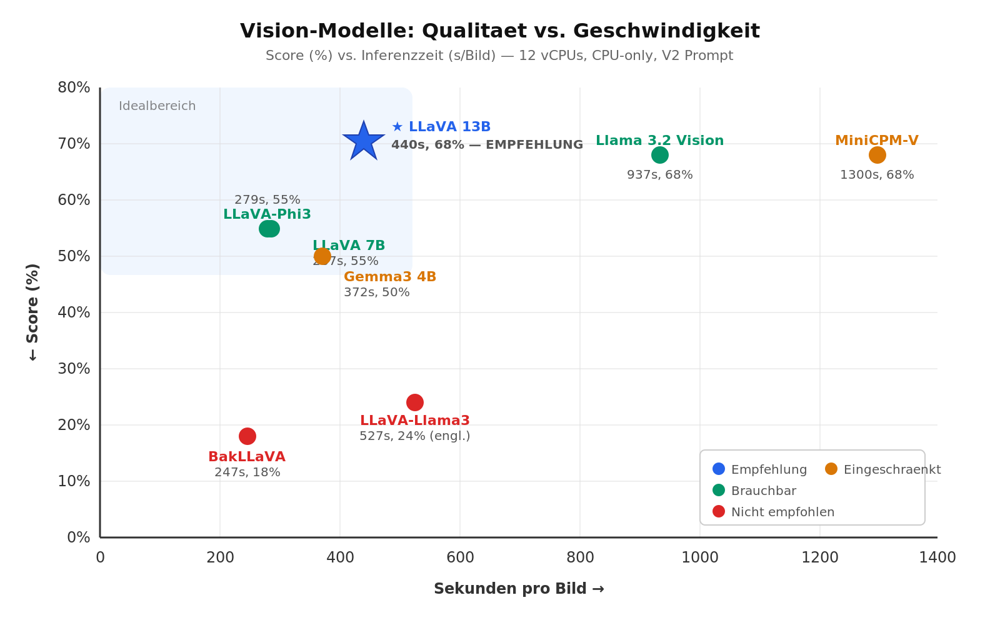
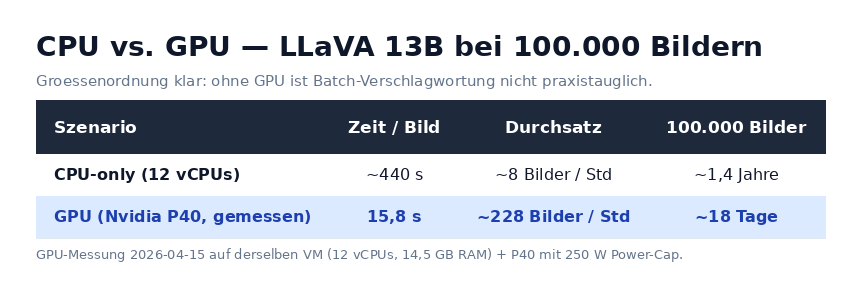

# Wie findet man 1 Foto unter 100.000 ohne Keyword? — Wie ich meine Fotobibliothek mit lokaler KI retten will

> 🔄 **HINWEIS FÜR DIE AKTUALISIERUNG DES LIVE-ARTIKELS (Stand 2026-04-15)**
>
> Diese Datei ist die **aktualisierte Fassung** nach dem GPU-Nachtest. Alle Stellen, die sich gegenüber dem bereits veröffentlichten LinkedIn-Artikel geändert haben, sind mit `🔄 UPDATE` markiert (vorher / nachher). Zusätzlich gibt es zwei neue Abschnitte ganz am Ende:
> 1. *„Nachtrag: Die GPU läuft — und sie überrascht"*  (GPU-Benchmark-Ergebnis)
> 2. *„Warum größer nicht automatisch besser ist"*  (Einordnung — Antwort auf die offensichtlichste Rückfrage)
>
> Pragmatische Empfehlung: den bestehenden LinkedIn-Post nicht komplett neu schreiben, sondern die markierten Stellen editieren und die beiden Nachträge als zusätzlichen Abschnitt anhängen. Den LinkedIn-Algorithmus freut ein substanzielles Update deutlich mehr als einen neuen Post ohne Kontext.

---

Ich fotografiere seit über 20 Jahren. Was als Hobby mit einer kleinen Kompaktkamera begann, wurde über die Jahre zur ernsthaften Leidenschaft — Reisen, Landschaften, Street, Makro, Portraits. Irgendwann stand die Zahl im Lightroom-Katalog bei 100.000 Bildern. Ja, ich habe tatsächlich noch alle.

Und ich finde nichts.

Das Foto vom Sonnenuntergang in Island? Irgendwo zwischen 2004 und 2007, vermutlich im Sommer. Die Makroaufnahme der Biene auf der lila Blüte? Keine Ahnung, welcher Ordner. Die nächtliche Skyline-Aufnahme mit Langzeitbelichtung? Liegt sicher irgendwo in „2006-Reise", aber in welchem der 40 Unterordner? Oder war es 2007?

Seien wir ehrlich: Disziplin und ein konsistenter Tagging-Workflow sind die größte Herausforderung für jeden Hobbyfotografen. Lightroom Classic bietet fantastische Suchfunktionen — Stichwortbäume, Smart-Sammlungen, Metadatenfilter. Aber nur, wenn die Bilder auch verschlagwortet sind. Bei 100.000 Bildern macht man das nicht mal eben an einem Wochenende nach.

## Die Idee: KI soll es richten

Die Idee lag auf der Hand: ein Vision-Modell, das jedes Bild analysiert und automatisch mit passenden deutschen Keywords versieht. Objekte, Szenen, Stimmung, Lichtsituation, Perspektive, Technik — alles, wonach man später suchen würde.

Die Idee ist natürlich nicht neu. Übrigens - die Idee hatte ich auch schon als ChatGPT gerade herauskam. Auch damals habe ich ein paar Links zu "Systemen" bekommen. Der Clou - kein einziger der Links war valide - alle waren von ChatGPT erfunden. Nun ja, inzwischen sind ein paar Monate vergangen.

Wie sieht es heute aus? Eine kurze Marktrecherche zeigt: es gibt durchaus kommerzielle Lösungen. Excire Search ist ein ausgereiftes Lightroom-Plugin, das Bilder lokal per KI analysiert und Keywords direkt in den Katalog schreibt — genau das, was ich suche. ON1 Photo Keyword AI macht Ähnliches, allerdings als Standalone-App außerhalb von Lightroom (Keywords werden über XMP-Dateien ausgetauscht). Der Haken: Excire kostet knapp 120 Euro, ON1 rund 80 Euro, und die Keywords sind primär auf Englisch. Für eine deutsche Fotobibliothek mit fotografisch-technischen Suchbegriffen wie „Gegenlicht", „Froschperspektive" oder „Goldene Stunde" ist das nicht ideal.

Aber schließlich gibt es Claude Code. Und die Lust am Experimentieren.

## Ein Wochenendprojekt: LR AutoTagger

Also habe ich mir ein eigenes Lightroom-Plugin gebaut. „LR AutoTagger" — ein FastAPI-Backend in Python, dazu ein Lua-Plugin für Lightroom Classic, das Vorschaubilder an den Server schickt und die zurückgelieferten Keywords direkt in den Katalog schreibt. Dazu Reverse Geocoding per GPS-Daten, Brennweiten-Klassifikation aus den EXIF-Daten und eine Sonnenstand-Berechnung für „Goldene Stunde" und „Blaue Stunde".

Mit Claude Code war der Prototyp tatsächlich an einem Wochenende lauffähig. Die Architektur ist einfach: das Plugin exportiert ein Vorschaubild, der Server analysiert es, die Keywords kommen zurück. Aber eine zentrale Frage blieb offen: welches Modell nimmt man für die Bildanalyse?

## Option 1: Kommerzielle APIs

Die naheliegende Lösung: eines der großen Frontier-Modelle über die API ansprechen. GPT-4o, Claude Sonnet, Gemini — alle können Bilder analysieren und würden die Aufgabe vermutlich souverän lösen. Aber was kostet das bei 100.000 Bildern?

Eine Überschlagsrechnung (Bild auf 1024 px skaliert, ca. 200 Tokens Output pro Bild):

| Modell | Input/Output pro 1M Tokens | Geschätzte Kosten für 100k Bilder |
|---|---|---|
| **GPT-4o** | $2,50 / $10,00 | ca. $350–400 |
| **Claude Sonnet 4.6** | $3,00 / $15,00 | ca. $500–800 |
| **Gemini 2.5 Flash** | $0,15 / $0,60 | ca. $20–30 |
| **Gemini 2.5 Pro** | $1,25 / $10,00 | ca. $200–300 |

*(Hinweis: Grobe Schätzungen. Die tatsächlichen Kosten hängen von der Bildauflösung, der Tokenisierung des jeweiligen Anbieters und der Länge des Prompts ab. Keine Gewähr für die Zahlen.)*

Gemini Flash ist erstaunlich günstig. GPT-4o und Claude Sonnet liegen im mittleren dreistelligen Bereich — machbar, aber für ein Hobbyprojekt nicht gerade ein Schnäppchen.

Doch es gibt ein zweites Problem, das schwerer wiegt als die Kosten: **Will ich wirklich alle meine privaten Fotos an einen Cloud-Dienst schicken?** Familienfotos, Bilder von Freunden, von meinem Zuhause — 20 Jahre meines Lebens, abgebildet in 100.000 Aufnahmen? Eher nicht.

## Option 2: Lokale Modelle mit Ollama

Also Plan B: Open-Source Vision-Modelle, die lokal auf meinem eigenen Server laufen. Kein Cloud-Upload, keine Abo-Kosten, volle Kontrolle. Total souverän! Ollama macht das Deployment denkbar einfach — Modell herunterladen, Prompt schicken, fertig.

Aber welches der verfügbaren Modelle kann das überhaupt? Mein Prompt ist nicht trivial: zehn verschiedene Kategorien, davon mehrere mit kontrollierten Vokabularen (Whitelists), Antwort auf Deutsch, Ausgabe als strukturiertes JSON. Das ist anspruchsvoller als ein simples „Beschreibe dieses Bild".

## Das Experiment: Neun Modelle im Direktvergleich

Ich habe neun lokal ausführbare Vision-Modelle getestet — von 1,4 bis 13 Milliarden Parameter. Alle mit demselben Prompt, denselben fünf Testbildern und einer transparenten Scoring-Methodik.

**Die Testbilder** (alle unter Creative-Commons-Lizenzen von Wikimedia Commons):

| | | |
|---|---|---|
|  |  |  |
| *Sonnenuntergang, Cómpeta* | *Makro: Biene auf Blüte* | *Manhattan bei Nacht* |
| [Tuxyso](https://commons.wikimedia.org/wiki/File:C%C3%B3mpeta_Complete_Panorama_View_Golden_Hour_02_2014.jpg) / CC BY-SA 3.0 | [ForestWander](https://commons.wikimedia.org/wiki/File:Bee-Purple-Flower-Macro_ForestWander.jpg) / CC BY-SA 3.0 US | [King of Hearts](https://commons.wikimedia.org/wiki/File:Lower_Manhattan_from_Jersey_City_September_2020_panorama.jpg) / CC BY-SA 4.0 |
|  |  | |
| *SW-Portrait* | *Herbstwald* | |
| [Martin Hricko](https://commons.wikimedia.org/wiki/File:Elderly_man_in_Rhodes,_Greece_(black_and_white).jpg) / CC BY 3.0 | [Vovogov90](https://commons.wikimedia.org/wiki/File:Autumn_Forest_Path_with_Tall_Trees.jpg) / CC0 (Public Domain) | |

Fünf völlig unterschiedliche Motive: Gegenlicht, Makro, Nachtaufnahme, Schwarzweiß-Portrait, Herbstlandschaft. Die Frage war: welches Modell erkennt nicht nur „Hund" und „Strand", sondern auch „Gegenlicht", „Froschperspektive" und „Langzeitbelichtung"?

**Setup:** CPU-only VM mit 12 vCPUs und 14,5 GB RAM — keine GPU, weil meine Nvidia P40 (... the bitter the boy ...) wegen eines Thermo-Problems gerade deaktiviert ist. Kein Luxus-Setup, sondern ein realistischer Worst Case.

**Die Ergebnisse:**

| Modell | Parameter | Ø Zeit/Bild | Score | Sprache |
|---|---|---|---|---|
| **LLaVA 13B** | 13B | **440 s** | **68 %** | Deutsch |
| Llama 3.2 Vision | 11B | 937 s | 68 % | Inkonsistent |
| MiniCPM-V | 8B | 1.300 s | 68 % | Deutsch ~ |
| LLaVA-Phi3 | 3,8B | 279 s | 55 % | Deutsch |
| LLaVA 7B | 7B | 287 s | 55 % | Deutsch |
| Gemma 3 4B | 4B | 372 s | 50 % | Deutsch |
| BakLLaVA | 7B | 247 s | 18 % | Gemischt |
| Moondream | 1,4B | — | — | Timeout |

**Der klare Gewinner: LLaVA 13B.** Gleiche Qualität wie die beiden nächsten Konkurrenten (Llama 3.2 Vision, MiniCPM-V), aber zwei- bis dreimal schneller. Und — entscheidend für meinen Anwendungsfall — zuverlässig auf Deutsch.

Spannend war auch, was *nicht* funktioniert hat. BakLLaVA, obwohl technisch verwandt mit LLaVA, lieferte Antworten wie „100% original, no manipulation" statt Keywords — offenbar für eine völlig andere Aufgabe trainiert. Moondream (nur 1,4B Parameter) war schlicht überfordert mit dem komplexen 10-Kategorien-Prompt.

## Die unbequeme Wahrheit: CPU reicht nicht

Die Benchmark-Ergebnisse zeigen aber auch eine Erkenntnis, die ich lieber nicht gehabt hätte: **Auf CPU ist Batch-Verschlagwortung nicht praxistauglich.** LLaVA 13B braucht auf meiner VM rund 7 Minuten pro Bild. Bei 100.000 Bildern wäre das über ein Jahr Rechenzeit.

> 🔄 **UPDATE — diese Tabelle im Live-Artikel ersetzen (geschätzte GPU-Zeit wurde gemessen):**
>
> **VORHER:**
>
> | Szenario | Zeit pro Bild | 100.000 Bilder |
> |---|---|---|
> | CPU-only (12 vCPUs) | ~440 s | ~1,4 Jahre |
> | GPU (Nvidia P40, erwartet) | ~6–12 s | **7–14 Tage** |
>
> **NACHHER:**
>
> | Szenario | Zeit pro Bild | Durchsatz | 100.000 Bilder |
> |---|---|---|---|
> | CPU-only (12 vCPUs) | ~440 s | ~8 Bilder/Std | ~1,4 Jahre |
> | **GPU (Nvidia P40, gemessen)** | **15,8 s** | **~228 Bilder/Std** | **~18 Tage** |

Eine GPU verwandelt das System von einem Experiment in ein Produktionswerkzeug. Die Nvidia P40 gibt es gebraucht ab ca. 275 Euro — im Vergleich zu den kommerziellen Plugins also kein Schnäppchen --- aber dafür kann man damit noch viele andere tolle Experimente machen!

## Fazit: Ein Wochenende, Claude Code und eine GPU-Einkaufsliste

Was ich an diesem Projekt am meisten schätze: die Mischung aus konkretem Nutzen und Experimentierspaß. Claude Code macht es möglich, ein Projekt wie dieses — Lightroom-Plugin, Backend-API, Bildanalyse-Pipeline, Benchmark-Framework — in einem Wochenende von der Idee zum lauffähigen System zu bringen. Nicht perfekt, aber funktional.

> 🔄 **UPDATE — den folgenden Absatz im Live-Artikel ersetzen (Ausblick auf 34B/26B ist überholt):**
>
> **VORHER:**
>
> > Der nächste Schritt ist klar: Server im Keller aufrüsten. Sobald meine GPU-Karte wieder läuft teste ich auch noch zwei größere Modelle, die auf CPU leider gar nicht laufen — LLaVA-Next (34B) und InternVL2 (26B). Wenn die auf einer GPU dieselbe Qualitätssteigerung bringen wie der Sprung von 7B auf 13B, wird es richtig spannend.
> >
> > Bis dahin tagge ich meine Bilder zumindest im interaktiven Modus — einzeln, bei Bedarf, mit LLaVA 13B auf CPU. Immerhin: die Nadel im Heuhaufen wird langsam sichtbar.
>
> **NACHHER:**
>
> > Inzwischen läuft die P40 wieder (aktive Kühlung, 250 W Power-Cap) und ich habe den kompletten Benchmark auf GPU wiederholt — inklusive vier zusätzlicher größerer Modelle. Das Ergebnis ist überraschend nüchtern: LLaVA 13B bleibt die Empfehlung. Details dazu im Nachtrag unten.
> >
> > Der Batch-Lauf über meine 100.000 Bilder ist gestartet. Die Nadel im Heuhaufen wird langsam sichtbar.

---

*Die Testbilder stammen von Wikimedia Commons unter Creative-Commons-Lizenzen. Der vollständige technische Benchmark mit Rohdaten und Methodik ist als Open-Source-Dokumentation verfügbar. API-Preise sind Schätzwerte basierend auf den offiziellen Preislisten von OpenAI, Anthropic und Google (Stand April 2026).*

---

> 🆕 **NEU FÜR DEN LIVE-ARTIKEL — ab hier beide Nachträge anhängen:**

## Nachtrag (15.04.2026): Die GPU läuft — und sie überrascht

Das Thermo-Problem der Tesla P40 ist gelöst (aktive Kühlung, Power-Cap auf 250 W angehoben, Max-Temperatur im Benchmark: 61 °C), Ollama nutzt die GPU wieder voll. Ich habe den kompletten Benchmark wiederholt — und gleich **vier größere Modelle** ergänzt, die auf CPU gar nicht erst getestet werden konnten:

- `llava:34b` (Yi-34B als Basis)
- `gemma3:27b` (Google, dichte 27B)
- `gemma4:26b` (Google Gemma 4, Mixture-of-Experts mit 4B aktiven Parametern)
- `gemma4:31b-it-q4_K_M` (Google Gemma 4, Q4-Quantisierung)

**Die Top 3 auf GPU:**

| Rang | Modell | Score | Ø Zeit/Bild |
|---|---|---|---|
| 🥇 | **LLaVA 13B** | 77 % | **15,8 s** |
| 🥈 | Gemma 4 31B (Q4) | 77 % | 146,7 s *(9× langsamer, gleicher Score)* |
| 🥉 | Gemma 3 27B | 73 % | 24,5 s |

Die Überraschung: das 34B-Modell (LLaVA-Next auf Yi-Basis) landet nur bei **45 % Score** — schlechter als ein 7B-Modell und dreimal langsamer als LLaVA 13B. Gemma 4 26B (die MoE-Variante mit nur 4 Mrd. aktiven Parametern) deadlockte bei einem der fünf Testbilder 17 Minuten lang und landet trotz 26 Mrd. Gesamtparametern ebenfalls unter der 13B-Baseline.

**Aktualisierte Quali-vs-Zeit-Übersicht:**

**Der GPU-Speedup ist dafür beeindruckend:**

Für LLaVA 13B heißt das konkret: **~228 Bilder pro Stunde**, also etwa **18 Tage für die komplette 100.000-Bibliothek**. Nicht die 7–14 Tage, die ich optimistisch geschätzt hatte, aber die Größenordnung stimmt — und vor allem: Produktionsbetrieb ist überhaupt erst möglich.

## Warum größer nicht automatisch besser ist

Die offensichtliche Rückfrage zu den Ergebnissen oben: **„Warum schneidet ein 34B-Modell schlechter ab als ein 13B-Modell? Das ist doch kontraintuitiv."**

Die Beobachtung ist tatsächlich plausibel. Der Hauptgrund ist architektonisch, der zweite sprachspezifisch. Daneben gibt es praktische Faktoren, die das Bild weiter verzerren.

**1. Der Vision-Encoder ist der Flaschenhals, nicht der Sprachteil.** Ein Vision-Language-Model besteht aus zwei Teilen: einem Vision-Encoder (meist ein CLIP-Derivat), der das Bild in einen Feature-Vektor überführt, und einem Sprachmodell, das aus diesen Features Text generiert. In den LLaVA-Varianten — 7B, 13B und 34B — ist der Vision-Encoder **identisch**: CLIP ViT-L/14 mit 336 px Eingabeauflösung. Mehr Sprachmodell-Parameter ändern nichts an dem, was das Bild an Information liefert. Aktuelle Forschung (u. a. CVPR 2024, „Improved Baselines with Visual Instruction Tuning") bestätigt: der Sprung von 7B auf 13B bringt auf einigen VLM-Benchmarks noch messbare Verbesserungen, danach flacht die Kurve ab — weil der geteilte Vision-Encoder zum limitierenden Faktor wird. Für wahrnehmungsabhängige Aufgaben (Licht erkennen, Perspektive einschätzen, Technik identifizieren) ist der Vision-Encoder entscheidend, nicht die Sprachmodell-Größe.

**2. Sprachspezifisches Training beeinflusst die Ausgabequalität.** LLaVA 34B basiert auf Yi-34B, einem bilingualen Modell mit Schwerpunkt Englisch und Chinesisch. LLaVA 13B basiert auf Vicuna (LLaMA-Derivat). Beide sind nicht explizit auf Deutsch optimiert — aber Yi-34B hat nach aktuellem Wissensstand einen noch geringeren Anteil deutschsprachiger Trainingsdaten. Für einen Prompt, der deutsche Ausgabe erzwingt, kann das ein Nachteil sein. Allerdings gibt es keinen publizierten Direktvergleich „Yi-34B vs. Vicuna-13B auf Deutsch", daher bleibt das eine Hypothese — keine bewiesene Ursache.

**3. Kleines Testset und technische Outlier.** Mein Benchmark umfasst fünf Bilder. Das reicht, um grobe Qualitätsunterschiede zu erkennen, ist aber statistisch nicht belastbar. Gemma 4 26B (MoE) deadlockte bei einem der fünf Testbilder 17 Minuten lang — ein einzelner Ausreißer, der den Durchschnitt massiv verzerrt. Das ist eher ein Ollama/GGUF-Integrationsproblem als ein fundamentales Modelldefizit.

**Was ich *nicht* behaupten kann:** Dass größere Modelle generell schlechter bei strukturierter Ausgabe sind. Die Forschung zeigt das Gegenteil — auf Benchmarks wie IFEval und FollowBench sind größere Modelle besser im Instruction Following, auch bei JSON und kontrollierten Vokabularen. Ebenso wäre es falsch zu behaupten, Mixture-of-Experts-Modelle würden nur auf dem Niveau ihrer aktiven Parameter arbeiten: MoE-Qualität skaliert mit den Gesamtparametern, nicht nur mit den aktiven. Ein 26B-MoE mit 4B aktiv ist deutlich stärker als ein dichtes 4B-Modell.

**Die ehrliche Erkenntnis:** In meinem konkreten Setup — fünf Testbilder, deutscher Prompt, identischer Vision-Encoder über alle LLaVA-Varianten — bringt das Hochskalieren des Sprachmodells keinen Qualitätsgewinn. Der Hauptgrund ist architektonisch (geteilter CLIP-Encoder), nicht sprachmodellseitig. Für andere Aufgabenprofile — englische Bildbeschreibungen, OCR, visuelle Frage-Antwort-Systeme — gelten vermutlich andere Ranglisten. Wer eine Pipeline optimiert, muss für seinen eigenen Anwendungsfall messen.

---

#KI #KünstlicheIntelligenz #Fotografie #Lightroom #MachineLearning #OpenSource #Ollama #LLaVA #VisionModels #Bildanalyse #Automatisierung #SideProject #ClaudeCode #AITools #Hobbyprojekt #Photography #LocalAI #PrivacyFirst
