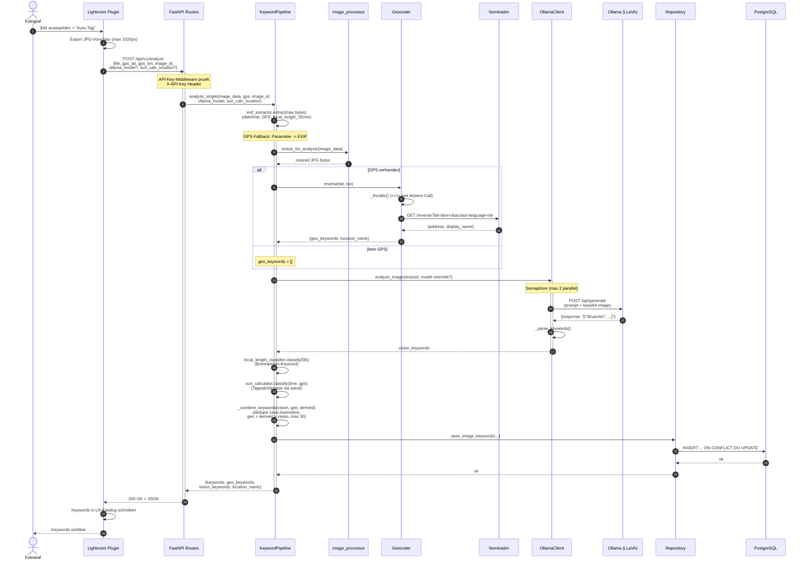
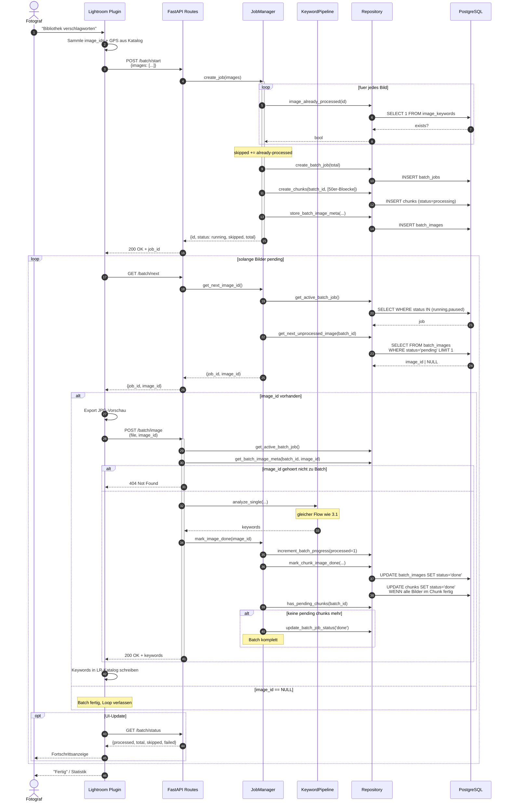
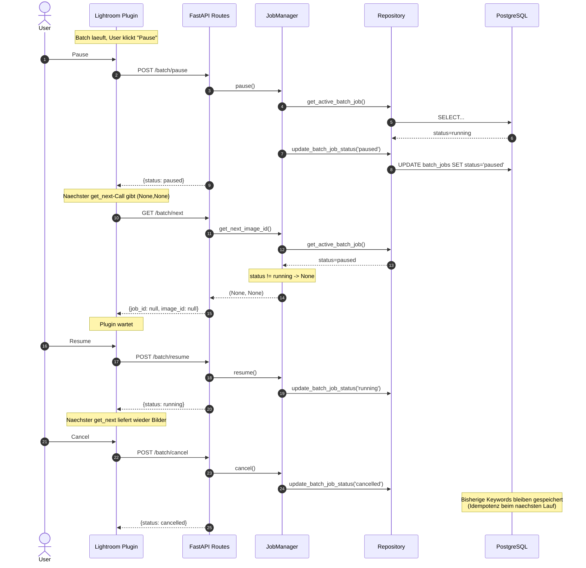
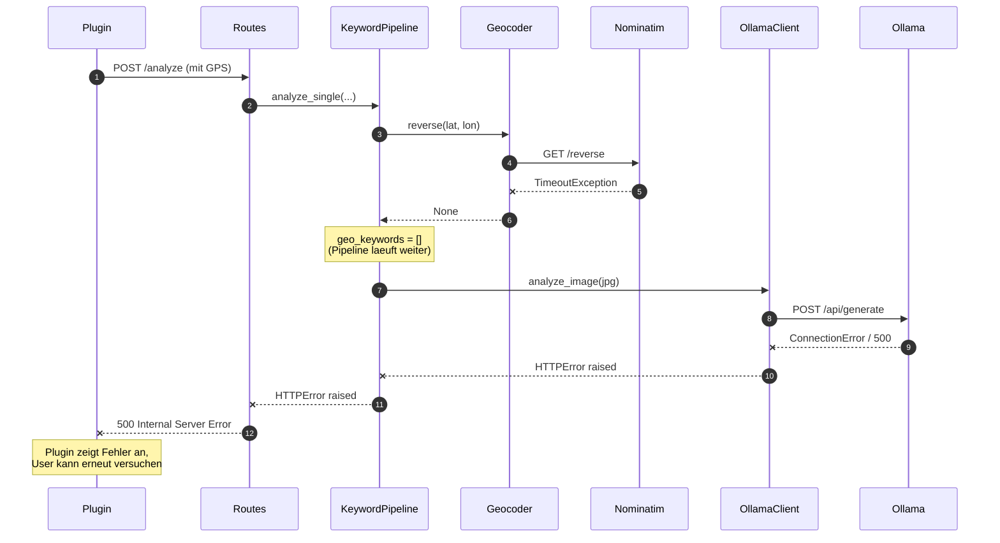

# Tech-Dokumentation

Architektur, Design-Entscheidungen, Regeln und Teststruktur.

---

## 1. Systemkontext

LR-AutoTag verschlagwortet eine Lightroom-Classic-Fotobibliothek (100k+ Bilder)
automatisch mit deutschen Schlagworten. Die Bildanalyse erfolgt durch ein
lokales Vision-Modell (LLaVA via Ollama, Nvidia P40 GPU); GPS-Koordinaten
werden ueber Reverse Geocoding (Nominatim) zu Ortsbezeichnungen aufgeloest.

**Komponenten:**
- **Lightroom-Plugin (Lua)** — UI-Integration, Bild-Export, Keyword-Rueckschreibung *(geplant)*
- **Backend-Service (FastAPI/Python)** — Orchestrierung, Job-Management, REST-API
- **Ollama** — Vision-Modell (Shared Service, andere Apps nutzen es auch)
- **PostgreSQL** — Job-Persistenz und Ergebnis-Cache
- **Nominatim** — Reverse Geocoding (oeffentliche OSM-Instanz)

Detaillierte fachliche Architektur: `LRAutoTagArchitektur.md` im Repo-Root.

---

## 2. Schichtenmodell (Backend)

```
┌─────────────────────────────────────────────┐
│  REST API           app/api/                │
│  (FastAPI Routes, Auth-Middleware)          │
├─────────────────────────────────────────────┤
│  Service Layer      app/services/           │
│  (JobManager: Batch-Lifecycle)              │
├─────────────────────────────────────────────┤
│  Pipeline           app/pipeline/           │
│  (KeywordPipeline orchestriert              │
│   Image-Processing, Ollama, Geocoder)       │
├─────────────────────────────────────────────┤
│  Repository Layer   app/db/                 │
│  (PostgreSQL Connection-Pool, CRUD)         │
└─────────────────────────────────────────────┘
            ↕                ↕
       PostgreSQL    Ollama, Nominatim
```

### Abhaengigkeitsregeln (CI-erzwungen)
- API-Layer importiert **nicht** direkt aus `app.db.repository`
- Pipeline-/Service-/DB-Layer importieren **nicht** aus `app.api`
- Repository-Layer importiert **nicht** aus `app.services` oder `app.pipeline`
- Externe Services (Ollama, Nominatim) nur ueber Clients im Pipeline-Layer

Diese Regeln werden im CI durch grep-basierte Architektur-Checks
(`.github/workflows/ci.yml`, Job `quality`) erzwungen.

---

## 3. Datenfluss

### 3.1 Interaktiver Modus (Einzelbild)



### 3.2 Batch-Modus (Plugin-getrieben)



### 3.3 Pause / Resume / Cancel



### 3.4 Fehlerfaelle (Ollama down, Geocoder Timeout)



---

## 3.5 Keyword-Kategorien und Ableitungsquellen

Pro Bild liefert die Pipeline bis zu `MAX_KEYWORDS` (Default: 30)
deduplizierte, deutsche Schlagworte. Sie stammen aus **drei getrennten
Quellen**, die unterschiedlich zustande kommen — das ist beim Debugging
und bei Prompt-Tuning wichtig.

### 3.5.1 Vision-basierte Kategorien (Ollama/LLaVA)

Werden vom Vision-Modell aus dem Bildinhalt extrahiert. Der Prompt
(`app/pipeline/ollama_client.py`) verlangt ein reines JSON-Array und
beschränkt die meisten Kategorien auf kontrollierte Whitelists, um
Halluzinationen zu unterbinden.

| Kategorie | Auswahl | Werte |
|---|---|---|
| **Objekte** | frei, max. 5 | beliebige deutsche Substantive |
| **Szene** | frei, max. 2 | beliebige Szenebeschreibungen |
| **Umgebung** | frei, max. 2 | beliebige Umgebungsbeschreibungen |
| **Tageszeit** | Whitelist, 1 Wert | Morgengrauen, Morgen, Vormittag, Mittag, Nachmittag, Abend, Daemmerung, Nacht |
| **Jahreszeit** | Whitelist, 1 Wert | Fruehling, Sommer, Herbst, Winter |
| **Wetter** | Whitelist, 1–2 Werte | Sonnig, Bewoelkt, Bedeckt, Regen, Schnee, Nebel, Gewitter, Wind, Sturm, Dunst |
| **Stimmung** | Whitelist, 1–2 Werte | Friedlich, Dramatisch, Melancholisch, Froehlich, Mystisch, Romantisch, Bedrohlich, Einsam, Lebhaft, Vertraeumt, Nostalgisch, Majestaetisch |
| **Lichtsituation** | Whitelist, 1–3 Werte | Frontlicht, Seitenlicht, Gegenlicht, Kantenlicht, Oberlicht, Natuerliches Licht, Kunstlicht, Mischlicht, Hartes Licht, Weiches Licht, Diffuses Licht, High-Key, Low-Key, Hell-Dunkel, Silhouette, Lichtstrahlen |
| **Perspektive** | Whitelist, genau 1 | Normalperspektive, Aufsicht, Vogelperspektive, Draufsicht, Untersicht, Froschperspektive, Schraegsicht |
| **Technik** | Whitelist, 0–2 Werte | Makro, Bokeh, Langzeitbelichtung, Bewegungsunschaerfe, Schwarzweiss, Infrarot |

> **Hintergrund zu den Whitelists:** Lichtsituation, Perspektive und
> Technik folgen etablierter Foto-/Filmterminologie (Drei-Punkt-
> Beleuchtung, DE-Wikipedia "Kameraperspektive", PhotoPills). „Goldene
> Stunde" und „Blaue Stunde" stehen bewusst **nicht** in der Whitelist —
> LLaVA kann warmes Innenraumlicht nicht zuverlaessig von echtem Sonnenstand
> unterscheiden, das wird deshalb in 3.5.3 berechnet.

### 3.5.2 EXIF-basierte Kategorien (kein Ollama)

Werden in `app/pipeline/focal_length_classifier.py` aus dem EXIF-Header
der Originalbytes gelesen (vor dem Resize, der EXIF zerstoert).

| Kategorie | Quelle | Ableitung |
|---|---|---|
| **Brennweite** | EXIF `FocalLengthIn35mmFilm` (oder `FocalLength` + Sensor-Geometrie) | `< 24 mm` → Superweitwinkel, `< 35 mm` → Weitwinkel, `< 70 mm` → Normalbrennweite, `≤ 200 mm` → Teleobjektiv, `> 200 mm` → Supertele |

Fehlt die Brennweite im EXIF, entfaellt das Keyword.

### 3.5.3 Zeit-/GPS-basierte Kategorien (astral)

Berechnet in `app/pipeline/sun_calculator.py` aus Zeit + Ort. Zeit kommt
aus EXIF `DateTimeOriginal`, der Zeitzonenanker bevorzugt aus EXIF
`OffsetTimeOriginal`, sonst Europe/Berlin als Default. GPS aus den
Plugin-Parametern oder EXIF.

| Kategorie | Ableitung |
|---|---|
| **Tageslichtphase** | Sonnen-Elevation via `astral.sun.elevation(observer, when)` → ≥ +6° = Tageslicht, −4° bis +6° = Goldene Stunde, −6° bis −4° = Blaue Stunde, < −6° = Nacht |
| **Ort** (Ortsname, Stadt, Region, Land) | GPS → Nominatim `/reverse?accept-language=de` → `geo_keywords` aus `address.{suburb, village, city, county, state, country}` |

**Fallback-Verhalten** bei fehlendem GPS:
- `SUN_CALC_DEFAULT_LOCATION=BAYERN` → Regensburg (49.0134° N, 12.1016° E)
- `SUN_CALC_DEFAULT_LOCATION=MUNICH` → München (48.1374° N, 11.5754° E)
- `SUN_CALC_DEFAULT_LOCATION=NONE` → kein Tageslichtphasen-Keyword

Fehlt die Aufnahmezeit, entfaellt die Tageslichtphase in jedem Fall —
fuer „wann wurde das Foto gemacht" gibt es keinen sinnvollen Default.

### 3.5.4 Kombinationslogik

`_combine_keywords()` in `keyword_pipeline.py` mergt in dieser
Prioritaetsreihenfolge, case-insensitive dedupliziert:

1. **Geo-Keywords** (hoechstes Vertrauen — exakter Ortsname)
2. **Derived-Keywords** (EXIF + Sonnenstand, exakt berechnet)
3. **Vision-Keywords** (Modell-Interpretation)

Danach Cap auf `settings.max_keywords` (Default 30).

### 3.5.5 Per-Request Overrides

Plugin und andere API-Clients koennen pro `/analyze` oder
`/batch/image` Request zwei Form-Felder setzen, die die
Backend-Defaults fuer genau diesen Request ueberschreiben:

- `ollama_model` — z.B. `llava:7b` statt des konfigurierten Standards
- `sun_calc_location` — `BAYERN` / `MUNICH` / `NONE`

Unbekannte `sun_calc_location`-Werte werden von der Route mit
**HTTP 400** abgewiesen. Unbekannte Modelle fuehren zum Ollama-Fehler
zur Laufzeit und landen als `500` beim Client.

---

## 4. Datenmodell

### 4.1 Tabellen

| Tabelle | Zweck |
|---|---|
| `batch_jobs` | Status und Fortschritt eines Batch-Laufs |
| `chunks` | 50er-Bloecke pro Batch, Retry-Einheit |
| `batch_images` | Per-Bild-Metadaten (GPS) und Verarbeitungs-Status pro Batch |
| `image_keywords` | Endgueltige Keywords pro `image_id` (idempotent) |
| `schema_version` | Migrationsversion |

### 4.2 Lebenszyklen

**`batch_jobs.status`**: `pending → running → done`
mit Seitenpfaden `running → paused → running` und `→ cancelled`.

**`chunks.status`**: `pending → processing → done | failed`,
bei `failed` mit `attempt < MAX_RETRY_ATTEMPTS` zurueck zu `pending`.

**`batch_images.status`**: `pending → done | failed`.

### 4.3 Idempotenz

`image_keywords.image_id` ist Primary Key. `save_image_keywords` ist ein
`INSERT ... ON CONFLICT DO UPDATE`. `image_already_processed()` filtert
beim Batch-Start Bilder, die schon Keywords haben — diese werden als
`skipped` gezaehlt.

---

## 5. Architecture Decision Records (ADRs)

### ADR-001: PostgreSQL als Task-Queue (kein Redis/RabbitMQ)
**Status:** akzeptiert
**Kontext:** Wir brauchen eine Job-Queue mit Persistenz, Retry und Checkpoint.
**Entscheidung:** PostgreSQL nutzen, das eh schon im System ist.
`SELECT ... FOR UPDATE SKIP LOCKED` reicht fuer das Volumen (100k Bilder
sind keine Hochlast). Keine zusaetzliche Komponente betreiben.
**Konsequenzen:** Weniger Ops-Komplexitaet. Keine sub-millisekunde Latenzen,
aber das ist hier irrelevant (Vision-Inferenz dominiert die Latenz).

### ADR-002: Plugin treibt den Batch-Modus (Pull-/Push-Hybrid)
**Status:** akzeptiert
**Kontext:** Im Batch-Modus muessen Bilder vom Lightroom-Katalog ans Backend
kommen. Drei Varianten wurden erwogen:
1. Backend liest Bilder direkt vom Dateisystem (NAS-Mount).
2. Plugin lädt **alle** Bilder beim Start hoch.
3. Plugin pollt `/batch/next` und lädt jedes Bild einzeln nach.
**Entscheidung:** Variante 3.
**Begruendung:**
- Variante 1 erfordert Server-Zugriff auf den Lightroom-Katalog → fragil
- Variante 2 erfordert riesige Uploads vor Verarbeitungsbeginn → langsamer Start
- Variante 3 ist Plugin-getrieben, das Plugin behält die Kontrolle und kann
  jederzeit pausieren/abbrechen
**Konsequenzen:** Backend braucht keinen Dateisystem-Zugriff auf die Bilder.
Plugin ist die einzige Quelle der Wahrheit fuer die Bilddaten.

### ADR-003: API-Key-Auth statt OAuth/JWT
**Status:** akzeptiert
**Kontext:** Backend laeuft im LAN, einziger Client ist das Plugin.
**Entscheidung:** Einfacher Header-API-Key (`X-API-Key`).
**Begruendung:** Kein User-Management noetig, keine Token-Refresh-Logik,
LAN-only Threat-Model. JWT waere over-engineered.
**Konsequenzen:** Bei Key-Rotation muessen alle Clients aktualisiert werden.
`/api/v1/health` ist explizit ausgenommen, damit Monitoring funktioniert.

### ADR-004: Ollama-Semaphore mit Hardlimit
**Status:** akzeptiert
**Kontext:** Ollama wird als Shared Service betrieben — eine andere App
nutzt denselben Daemon. Wir duerfen sie nicht blockieren.
**Entscheidung:** Modul-globales `asyncio.Semaphore(OLLAMA_MAX_CONCURRENT)`
in `ollama_client.py`. Default: 2.
**Konsequenzen:** Bei steigender Last queueen Requests im Backend, statt
Ollama zu ueberfluten. Konfigurierbar via `.env`.

### ADR-005: Nominatim mit 1 req/s Throttle
**Status:** akzeptiert
**Kontext:** Wir nutzen die oeffentliche Nominatim-Instanz von OSM. Deren
Nutzungsbedingungen erlauben 1 Request pro Sekunde.
**Entscheidung:** Modul-globaler Lock + monotone Zeitstempel im Geocoder.
**Konsequenzen:** Bei Batches mit 100k Bildern wird Geocoding ein
Bottleneck (~28h fuer 100k Geocodings). Mitigation: eigene Nominatim-Instanz
betreiben oder per `NOMINATIM_URL` umbiegen.

### ADR-006: Eigene PostgreSQL-DB statt Shared
**Status:** akzeptiert
**Kontext:** Ein anderer Service nutzt schon PostgreSQL auf demselben Server.
**Entscheidung:** Eigene Datenbank `lr_autotag` mit eigenem User. Kein
Schemen-Sharing.
**Konsequenzen:** Vollstaendige Isolation, keine Migrations-Konflikte.

### ADR-007: Coverage-Gates 80%/70% statt 95%
**Status:** akzeptiert
**Kontext:** Wie strikt sollen die Coverage-Gates sein?
**Entscheidung:** 80% Line, 70% Branch als CI-Gate. Aktueller Stand: 94%/94%.
**Begruendung:** Hohes Niveau erwuenscht, aber nicht jeder Edge Case ist
wirtschaftlich testbar. Die kritischen Module (Pipeline, JobManager, Auth)
liegen alle ueber 90%.

---

## 6. Code-Konventionen

| Aspekt | Regel |
|---|---|
| Python-Version | ≥ 3.12 |
| Line-Length | 120 Zeichen |
| Linter | ruff (E, F, I, W) |
| Formatter | ruff format |
| Cyclomatic Complexity | C901 max 15 |
| Async-Style | FastAPI + asyncio + httpx async |
| DB-Client | psycopg 3 (async) mit Connection Pool |
| Sprache im Code | Englisch |
| Sprache fuer Keywords/User-UI | Deutsch |
| Tests | pytest, pytest-asyncio, fixture-basiert |

---

## 7. Teststruktur

### 7.1 Stufen

Detail-Spezifikation: `TEST_SPEC.md` (Repo-Root).

| Stufe | Verzeichnis | Was wird getestet | DB | Externe Services |
|---|---|---|---|---|
| Unit | `backend/tests/unit/` | Einzelne Funktionen/Klassen | Mock | Mock |
| Integration | `backend/tests/integration/` | Modul-Zusammenspiel | echte Test-DB | Mock |
| System | `backend/tests/system/` | Kompletter FastAPI-Stack | Mock-Repo | Mock |
| NFA | `backend/tests/nfa/` | Performance, Security | Mock | Mock |

### 7.2 Aktueller Stand

| | Tests |
|---|---:|
| Unit | 71 |
| Integration | 27 |
| System | 24 |
| NFA | 14 |
| **Gesamt** | **136** |

**Coverage:** 94% Line / 94% Combined Branch (Stand: April 2026)

### 7.3 Testableitung

Tests werden nach diesen Methoden abgeleitet (siehe `TEST_SPEC.md` Abschnitt 3):
- **Happy Path** — Standardfall pro Funktion
- **Fehlerfaelle** — externe Services down, ungueltige Eingaben
- **Grenzwertanalyse** — Min/Max/exakte Schwellen (0, 1, 50, 51, 100k)
- **Aequivalenzklassen** — Bild-Format-Klassen, GPS-Klassen, Status-Klassen
- **Zustandsuebergaenge** — Batch-Lifecycle (pending→running→…)

### 7.4 Tests lokal ausfuehren

```bash
cd backend
.venv/bin/pytest tests/unit/                                           # schnell, immer
TEST_DATABASE_URL=postgresql://localhost/lr_autotag_test \
  .venv/bin/pytest tests/integration/ tests/system/ tests/nfa/         # mit echter DB
.venv/bin/pytest --cov=app --cov-branch --cov-fail-under=80            # mit Coverage
```

### 7.5 Pytest-Marker

```python
@pytest.mark.unit          # keine externen Abhaengigkeiten
@pytest.mark.integration   # braucht PostgreSQL
@pytest.mark.system        # FastAPI TestClient + Mock-Repo
@pytest.mark.performance   # Benchmark-Tests
@pytest.mark.security      # Security-Tests
@pytest.mark.slow          # > 5s
```

---

## 8. CI/CD-Pipeline

GitHub Actions, Workflow: `.github/workflows/ci.yml`. Drei Jobs:

### 8.1 `quality`
- ruff lint + format check
- ruff Complexity-Gate (C901 max 15)
- bandit Security-Scan
- pip-audit Dependency-Audit
- 3× Architektur-Konformitaet (Layer-Imports)
- 5× OWASP-Checks (API-Key-Middleware, SQL-Injection, hardcoded Secrets,
  Ollama-Semaphore, Nominatim-Throttle)

### 8.2 `test`
- PostgreSQL 16 als Service-Container
- Unit + Integration + System Tests
- Coverage-Report (HTML als Artifact)
- Line-Coverage-Gate ≥ 80%
- Branch-Coverage-Gate ≥ 70%
- Test-Summary in `$GITHUB_STEP_SUMMARY`

### 8.3 `nfa`
- Nur bei `push` auf `main` (nicht bei jedem PR)
- PostgreSQL 16 als Service
- Performance-Tests mit `--timeout=120`
- Security-Tests mit `--timeout=60`

---

## 9. Bekannte Einschraenkungen

| Limitation | Workaround / Plan |
|---|---|
| Lightroom-Plugin noch nicht implementiert | Sprint 3 |
| Auto-Resume nach Server-Crash nicht implementiert | Manuell `chunks` zuruecksetzen, Sprint 4 |
| Geocoding ist Bottleneck bei 100k Bildern | Eigene Nominatim-Instanz nutzen |
| `OLLAMA_MAX_CONCURRENT` ist statisch | Tageszeit-basierte Anpassung im Backlog |
| Keine Volltext-Suche ueber Keywords | LR uebernimmt das clientseitig |

---

## 10. Verweise

| Dokument | Inhalt |
|---|---|
| `LRAutoTagArchitektur.md` | Fachliche Architektur, Backlog, Sprint-Plan |
| `__CLAUDE.md` | Projekt-Leitlinien (Coding-Konventionen, Layer-Regeln) |
| `TEST_SPEC.md` | Testspezifikation mit Testfaellen pro Modul |
| `docs/installation.md` | Installation und Troubleshooting |
| `docs/admin.md` | Admin-Setup, Plugin↔Backend-Konfiguration |
| `docs/user-guide.md` | User Guide fuer Fotografen (nicht-technisch) |
| `docs/tech.md` | Dieses Dokument |
| `.github/workflows/ci.yml` | CI/CD-Pipeline |
